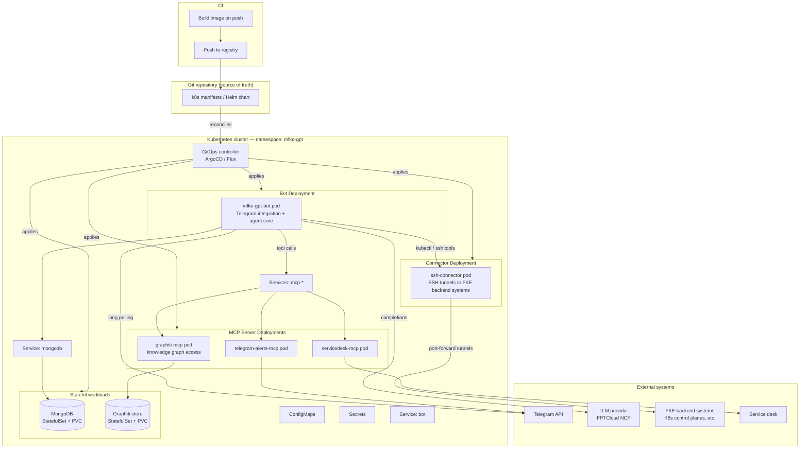

# MFKE GPT — Infrastructure & Deployment Architecture

**Scope:** infrastructure, connectivity, and operational setup layer. Application/software design (agent loop, tools, security, Telegram integration) is covered in `SOLUTION_ARCHITECTURE.md`.

**Status:** reflects current deployed setup and the reasoning behind key decisions.

## 1. Overview

MFKE GPT acts as a central AI agent for FKE (the platform/system it operates against), which means it must reach into multiple independent systems to gather data and take action — not just one API. The infrastructure layer exists to solve three problems: how the agent reaches those systems securely, where it keeps durable knowledge about FKE, and how to run all of this without a large recurring cost. Each section below documents a decision that was made, the alternatives considered, and why the chosen option fit MFKE GPT's specific constraints.

## 2. Multi-System Connectivity

### 2.1 Problem

MFKE GPT is designed to answer questions and investigate issues across FKE as a whole, which means its tool calls need to reach several independent backend systems — primarily the Kubernetes control plane, but potentially other internal services as FKE grows. These systems are not centrally exposed behind a single gateway, so the agent host needs a way to reach each of them individually.

### 2.2 Decision: SSH port forwarding

We evaluated the usual options for cross-system connectivity — a service mesh, a VPN mesh, or a purpose-built API gateway — but the actual data volume flowing through the Kubernetes control plane path is small (control-plane queries and command results, not bulk data transfer). Given that, the overhead of standing up and operating a mesh or gateway wasn't justified. We chose **SSH port forwarding** instead:

- It requires no additional infrastructure component to deploy, patch, or monitor — SSH is already present on every Linux host we operate.
- Setup is a single command/config per target system, which keeps onboarding a new backend system to the agent's reach fast.
- It's a well-understood, heavily audited protocol with mature tooling (key management, `known_hosts`, connection multiplexing), rather than a new moving part with its own failure modes.

This is a deliberate trade against "the more scalable enterprise-grid answer" — a service mesh would generalize better to high-throughput, many-service topologies, but for FKE's actual current shape (low-volume control-plane traffic, small number of systems, Linux-native environment) SSH port forwarding gets the same practical outcome with far less operational surface area.

### 2.3 Trade-offs to revisit later

SSH port forwarding is a per-host, per-tunnel setup — it doesn't provide the automatic service discovery or load balancing a mesh would. If the number of backend systems or the traffic volume grows substantially, this decision should be revisited rather than assumed permanent.

## 3. Knowledge Base

### 3.1 Problem

MFKE GPT needs durable knowledge about FKE beyond what fits in a single conversation — how systems relate to each other, prior incidents, operational patterns. This knowledge is inherently relational (systems, components, and incidents connect to each other) and it grows continuously as the agent operates, rather than being a fixed corpus loaded once.

### 3.2 Decision: knowledge graph over vector database

A vector database was the default option considered, since it's the common choice for giving an LLM agent retrievable long-term memory. We chose against it because FKE's knowledge doesn't fit a pure similarity-search model well — the value is in the *relationships* between entities (which system depends on which, which incident affected which component), not just in retrieving semantically similar chunks of text. A vector store would lose that structure.

Instead we use a **knowledge graph** — specifically [Graphiti](https://github.com/getzep/graphiti) — which models FKE's knowledge as entities and relationships that can be queried and traversed, and which is explicitly designed for temporally-evolving graphs (facts that get added, superseded, or connected over time), matching how FKE's own knowledge grows in practice.

### 3.3 Integration: MCP server, not manual curation

Rather than have an admin manually curate or update the knowledge base, MFKE GPT updates it **automatically** as it operates. Graphiti is exposed to the agent through an **MCP server**, so the agent's own tool-calling loop (§4 of the software architecture doc) can write new facts and relationships into the graph as a natural side effect of investigations — no separate ETL pipeline or admin workflow required. This keeps the knowledge base current without adding an operational burden on the FKE team.

## 4. MFKE-Specific Tooling

Generic infrastructure tools (kubectl wrappers, log/metric queries) cover general debugging, but they don't capture the specific, repeatable steps the FKE L3 team actually takes when triaging a cluster issue. Rather than rely on the agent to rediscover that procedure from generic primitives each time, we wrote **custom tools that directly mirror the FKE L3 debugging playbook** — encoding the same sequence of checks and lookups an experienced L3 engineer would perform. This trades some generality for reliability and speed on the debugging scenarios that matter most in practice, and it means the agent's investigations read the way an L3 engineer's would, rather than as ad-hoc generic exploration.

## 5. Model and Provider Choice — Cost Optimization

Running an always-on agent that makes frequent LLM calls (including multi-step tool-calling loops, §4.2 of the software doc) against a frontier commercial API can get expensive quickly, especially at FKE's operating cadence. To keep the system close to zero marginal cost, we run an **open-source LLM model** hosted on **FPTCloud NCP** as the inference provider, instead of a pay-per-token commercial API.

This decision trades engineering time for operating cost: self-hosting/open-source models require more upfront effort to select, tune, and validate for the tool-calling and reasoning quality MFKE GPT needs, and there's ongoing effort to keep the model current as better open options appear. In exchange, the system runs at near-zero marginal cost once set up, which matters for an agent designed to run continuously rather than on discrete, billed-per-use requests.

## 6. External System Access — Telegram Alerts and Service Desk

Beyond FKE's own systems, MFKE GPT also needs to read from and act on external channels — Telegram alert streams and the service desk ticketing system. These are integrated the same way as the knowledge base (§3.3): via **MCP servers**, giving the agent a consistent tool-calling interface to heterogeneous external systems rather than a bespoke integration per system. This keeps the pattern uniform: every external capability the agent gains — whether it's updating the knowledge graph, reading an alert, or filing a ticket — is added as an MCP-exposed tool rather than a one-off client library wired directly into the bot.

## 7. Conversation Context Management

### 7.1 Chat-session model

MFKE GPT models each user's ongoing conversation as a **Telegram forum topic**, mirroring the session concept familiar from consumer chat products (a "thread" per conversation, the way ChatGPT scopes a conversation to a session). This is implemented at the software layer as the forum-topic-per-user UX described in the Telegram integration section of the software architecture doc — the infrastructure-relevant point is that Telegram's own topic feature is used *as* the session boundary, rather than building a separate session-management concept from scratch.

### 7.2 Persistence

Conversation history is persisted in **MongoDB**, giving each session's memory durability across bot restarts, deploys, and the connection-watchdog-driven polling recovery described in the software doc — a restart doesn't lose the user's conversation context, and the agent's next reply in a topic still has full access to everything said in that topic before.

## 8. Deployment Topology (Target Architecture)

**Status note:** the repository currently ships a two-container `docker-compose.yml` (bot + MongoDB) for local/single-host use. What follows is the **target production deployment** onto Kubernetes with GitOps-managed delivery — it has not been built yet in this repo, and is documented here to guide that work.

### 8.1 Why Kubernetes and GitOps

The bot already depends on Kubernetes concepts at the application layer (it uses `kubectl` as an investigation tool against FKE's clusters, §4.6/4.9 of the software doc), so running the bot itself on Kubernetes keeps the operational model consistent rather than mixing a bare-VM bot with a K8s-native target environment. GitOps (declarative manifests in Git, reconciled continuously by a cluster-side controller) is the DevOps best practice fit here because it gives us the properties a bot that autonomously executes infrastructure tools should have: every change to what's running is code-reviewed and auditable, the cluster is continuously reconciled back to the declared state (self-healing against drift or manual `kubectl edit` mistakes), and rollback is a Git revert rather than a manual undo.

### 8.2 Cluster topology

### 8.3 Workload breakdown

| Workload | Kind | Why this shape |
|---|---|---|
| `mfke-gpt-bot` | Deployment (1 replica) | Runs the Telegram integration and agent core (`src/bot/main.py`). Single replica today because conversation state lives in MongoDB, not in-process, but the long-polling model and in-memory rate limiter (§6.4 of the software doc) mean horizontal scaling isn't safe yet without further changes — noted as a follow-up, not a blocker to shipping this topology. |
| `ssh-connector` | Deployment (n replicas) | Dedicated pod holding the SSH port-forward tunnels described in §2 — kept as its own workload rather than baked into the bot pod, so a tunnel restart/reconnect doesn't require restarting the bot process, and so tunnel credentials (SSH keys) are scoped to a smaller blast radius than the full bot pod. |
| `graphiti-mcp`, `telegram-alerts-mcp`, `servicedesk-mcp` | Deployments (1 replica each) | Each MCP server (§3.3, §6) runs as its own pod behind its own Service, giving each external integration an independent restart/scale/failure boundary — a crashing service-desk MCP server shouldn't take down the knowledge graph MCP server or the bot itself. |
| `mongodb` | StatefulSet + PersistentVolumeClaim | Conversation history (§7.2) needs stable storage identity and durable volumes across pod rescheduling — a StatefulSet (not a Deployment) is the correct primitive for this. |
| Graphiti backing store | StatefulSet + PersistentVolumeClaim | Same reasoning as MongoDB — the knowledge graph is durable state, not a stateless service. |

### 8.4 GitOps delivery flow

1. A change (code, config, or manifest) is merged to the main branch in Git.
2. CI builds the bot image from the existing `Dockerfile` and pushes it to a registry, then updates the image tag reference in the manifests/Helm chart (still in Git — this is the only "push" step; nothing talks to the cluster directly).
3. The in-cluster GitOps controller (ArgoCD or Flux) detects the change in Git and reconciles the cluster to match — pulling the new image, rolling the affected Deployment(s).
4. The controller continuously compares live cluster state against the Git-declared state on an ongoing basis (not just at deploy time), so manual out-of-band changes get flagged or automatically reverted, keeping the cluster's actual state provably equal to what's committed.

This gives the "always up to date, follows DevOps best practice" property from a different angle than CI/CD alone: even between deploys, the cluster can't silently drift from what's in Git, which matters for a system where an AI agent has tool access into production-adjacent infrastructure.

### 8.5 Secrets and configuration in this topology

Non-secret configuration (toolset tags, log level, feature flags) moves into ConfigMaps; credentials (LLM API key, Telegram bot token, MongoDB URI, SSH keys for the connector pod) move into Kubernetes Secrets rather than the current `.env`-file approach (§6.7 of the software doc). Secrets should be sourced from a proper secrets manager (e.g. Sealed Secrets, External Secrets Operator, or the cluster's cloud-native secret store) rather than committed to Git in plaintext — GitOps manages the *deployment* of secrets references, not the secret values themselves.
