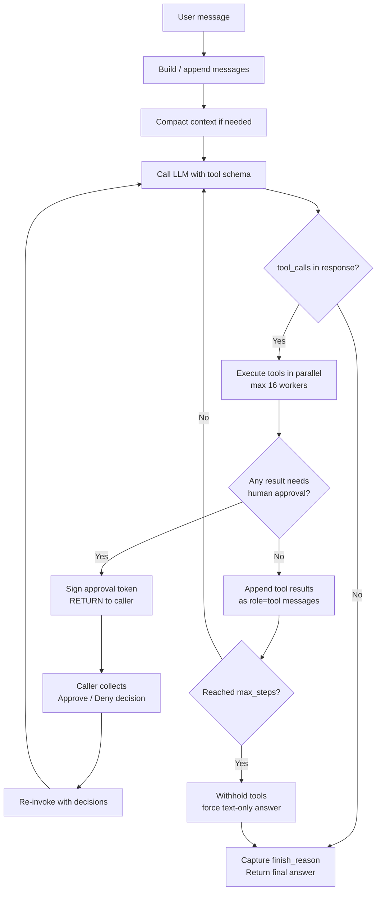

# MFKE GPT — Software Architecture Document

**Scope:** software/application layer only. Infrastructure, deployment topology, and environment setup are covered in a separate document.

**Status:** reflects current `main` branch implementation.

## 1. Overview

MFKE GPT is an AI agent that investigates and answers operational questions through natural-language conversation. It is exposed to end users exclusively through Telegram group chats. The system is composed of three cooperating layers:

1. **Telegram Integration Layer** — receives chat updates, renders streaming responses, and surfaces interactive approval prompts as inline buttons.
2. **Agent Core (MFKE GPT engine)** — a tool-calling LLM loop that plans, calls tools, and synthesizes answers, with conversation memory and an interactive tool-approval gate.
3. **Platform Services** — permission/authorization, conversation persistence (MongoDB), rate limiting, and health/liveness reporting.

## 2. System Context

```
                 ┌─────────────────────────┐
   Telegram      │   Telegram Bot Process   │
   group chat  ─▶│  (long polling, PTB 21)  │
                 │                          │
                 │  handlers ─▶ services ─▶ │──▶ MFKE GPT Agent Core ──▶ LLM Provider
                 │              │           │        │                (Anthropic/OpenAI)
                 │              ▼           │        ▼
                 │          MongoDB          │    Tool Executor ──▶ Investigation Tools
                 └─────────────────────────┘        (kubectl, logs, metrics, ...)
```

The bot runs as a single long-lived process. There is no public HTTP surface for Telegram itself (polling, not webhooks); the only exposed endpoint is a local health-check server used for liveness/readiness probing.

## 3. Component Map

| Component | File(s) | Responsibility |
|---|---|---|
| Bot entrypoint | `src/bot/main.py` | Process bootstrap, handler registration, polling loop, watchdog |
| Command handler | `src/bot/handlers/command_handler.py` | `/start /help /permissions /clear /new` etc. |
| Message handler | `src/bot/handlers/message_handler.py` | Chat message routing, streaming response rendering, forum-topic UX |
| Privilege handler | `src/bot/handlers/privilege_handler.py` | Inline-button callbacks: permission approvals and tool approvals |
| MFKE GPT service | `src/bot/services/holmes_service.py` | Agent core: LLM loop, tool execution, tool-approval orchestration |
| Conversation service | `src/bot/services/conversation_service.py` | Conversation/message persistence and retrieval |
| Permission service | `src/bot/services/permission_service.py` | Authorization model, permission-request workflow |
| Models | `src/bot/models/{conversation,user,permission_request}.py` | Data schemas |
| Config | `src/bot/utils/config.py` | Environment-driven configuration |
| Health | `src/bot/utils/health.py` | Liveness/readiness HTTP endpoints |
| Decorators | `src/bot/utils/decorators.py` | `@admin_only`, `@rate_limit` |

## 4. MFKE GPT Core Engine — Reasoning Loop Design

`HolmesService` (`src/bot/services/holmes_service.py`) wraps the MFKE GPT core engine (a tool-calling LLM library, `ToolCallingLLM`) and adapts it to the bot's conversation and approval model. The bot repository does not implement the reasoning loop itself — it is implemented inside the core engine. This section documents the agent's methodology (4.1-4.2), the engine's actual loop mechanics (4.3-4.8), and how the bot wraps it (4.9-4.13).

### 4.1 Agent methodology

MFKE GPT follows a **reason-act-observe** pattern (the same family as the "ReAct" style used by most modern tool-calling LLM agents): the model reasons about the question in natural language, decides whether it needs more information, acts by calling a tool if so, observes the tool's result, and repeats — rather than following a fixed, hand-scripted investigation script. This makes the agent's behavior adaptive to the specific question asked instead of a rigid decision tree, while still being bounded and auditable. Three design choices keep that adaptiveness safe and practical:

- **Bounded iteration** — the loop cannot run forever; it has a hard step ceiling (§4.5), so an unproductive investigation fails loudly rather than consuming unbounded time or LLM calls.
- **Human approval as a loop-native interrupt** — risky actions don't get filtered by an external policy layer; the loop itself pauses and hands control back when a tool call needs sign-off (§4.7), then resumes exactly where it left off once a decision is made.
- **Automatic context hygiene** — the loop manages its own message history size (§4.8) so a long, tool-call-heavy investigation doesn't silently degrade once it grows past the model's context window.

### 4.2 Loop flow at a glance



### 4.3 Prompt construction

A new investigation starts from a builder that assembles the initial message list: a system prompt rendered from a template (including toolset instructions, available "skills", and environment context such as cluster name) plus a user-turn message carrying the question. This produces the seed `messages = [{"role": "system", ...}, {"role": "user", ...}]` list that the loop below operates on. Every subsequent iteration appends to this same list rather than reconstructing it.

### 4.4 The reasoning loop itself

The engine exposes two entrypoints, but there is only **one** real loop implementation. The "non-streaming" entrypoint is a thin wrapper that fully drains the "streaming" entrypoint's generator and reconstructs a single result object — so describing the streaming version describes both.

The loop is a bounded `while i < max_steps` iteration. Each pass:

1. Calls the LLM (via a provider-agnostic completion call, not the raw OpenAI/Anthropic SDK directly) with the current `messages` list, the tool schema (see §4.6), and `tool_choice="auto"`. Note: even the "streaming" method does not request token-level streaming from the LLM provider — it calls the provider in blocking mode and emits its own coarser-grained events after each sub-step (LLM response, per-tool-start, per-tool-result), not per token.
2. Inspects the response for a `tool_calls` field. If tool calls are present, they are executed **in parallel** via a thread pool (max 16 concurrent), not sequentially — the loop pays the latency of the slowest tool per iteration, not the sum of all tools.
3. Each tool result is converted to a `role: tool` message and appended back into `messages`, which becomes the input to the next iteration's LLM call.
4. If the response contains no tool calls, the loop treats the turn as answered and exits — this is the normal, expected termination path.

### 4.5 Loop termination and iteration bound

Termination is not driven by a token budget — it's driven by two conditions:

- **Normal**: the LLM returns a response with no tool calls. The engine's `finish_reason` from that response is captured and surfaced.
- **Forced**: on the final permitted iteration (`i == max_steps`), the engine withholds the tool schema entirely from the LLM call — forcing a text-only answer instead of allowing another tool-call round. If even that iteration still can't produce a stop condition, the loop raises an explicit "too many LLM calls" error rather than looping forever. This means a runaway investigation fails loudly and predictably rather than silently degrading.

### 4.6 Tool schema and invocation

Tool definitions are converted to the standard OpenAI function-calling schema (`{"type": "function", "function": {"name", "description", "parameters"}}`) and passed to the LLM call with `tool_choice="auto"` — this is why the engine can swap LLM providers without changing tool definitions, as long as the provider speaks the same function-calling convention. On the execution side, each tool invocation is wrapped individually in error handling: a tool that raises an exception does not crash the loop, it produces an error-status result that gets fed back to the LLM as a tool message, letting the model decide how to react (retry differently, ask the user, or give up gracefully). Malformed tool-call arguments (invalid JSON from the LLM) are similarly caught and treated as empty arguments with a warning, rather than raising. A repeated-call guard also short-circuits identical tool calls issued back-to-back, protecting against a model that gets stuck retrying the same call.

### 4.7 Approval interruption within the loop

Tool approval is not a wrapper bolted on from outside — it is a first-class branch inside the loop itself. After parallel tool execution, each result is checked for an approval-required status. If flagged, the tool call is **not** fed back to the LLM as a normal result; instead it is collected into a pending-approvals list, the assistant's tool-call entry in the message list is marked with a signed approval token, and the loop **returns immediately** without exhausting further iterations — no thread or in-memory state is kept waiting inside the engine. Resumption is a fresh call: the caller (the bot's approval-decision collection, see §5.2) supplies signed approval/denial decisions on the next invocation, the engine verifies each token, re-invokes approved tools with an "approved" flag, injects denial messages for rejected ones, and only then continues the loop from where it left off. This design — pause-by-returning rather than pause-by-blocking inside the engine — is what makes the bot's own recursive stream-resumption pattern (§4.11) necessary and correct, since the engine gives back full control rather than holding any suspended execution state itself.

### 4.8 Context window management

Before every LLM call, the engine checks whether the accumulated message history needs compaction and, if so, summarizes or trims it — this runs automatically inside the loop, not as a separate maintenance step the bot has to trigger. Independently, any single tool result that is unusually large gets truncated and spilled to disk with a stub reference left in the message (only when a file-access-capable tool is available to retrieve it later), preventing one verbose tool call from blowing the context budget for the rest of the investigation. Loop-detection state for the repeated-call guard is reset after a compaction pass, since message shape changes after summarization.

### 4.9 Bot-side initialization

`HolmesService.initialize()` loads engine configuration (from a config file path or environment variables), then constructs two engine objects: a **tool executor**, scoped to a specific set of toolset tags (`CORE`, `CLI`) with a prerequisite cache enabled, and a **tool-calling LLM** bound to that executor and the resolved LLM credentials. A `ThreadPoolExecutor` (20 workers) is created because the underlying engine's call is synchronous and must not block the bot's asyncio event loop.

### 4.10 Bot-side turn execution — two paths

Every user message enters `HolmesService.chat()`, which appends the message to the `Conversation` model, formats prior turns into the engine's expected message schema, and dispatches to one of two paths depending on whether streaming is enabled for the user:

- **Non-streaming path** — runs the engine's blocking `call()` inside the thread pool, passing an `approval_callback` closure. Returns a single `LLMResult` once the entire turn (including any tool calls) completes.
- **Streaming path** — runs the engine's `call_stream()` generator inside the thread pool and iterates it. Note this is not token-level streaming (§4.4) — it is coarse event streaming, translated here into a normalized schema the Telegram layer understands: `content`, `tool_call`, `tool_result`, `task_update`, `thinking`, `approval_result`, `event`.

### 4.11 Bot-side loop termination and resumption

The non-streaming path terminates naturally when the engine returns its final result object. The streaming path terminates when its event generator is exhausted — **except** when an approval-required event is emitted mid-loop (§4.7). In that case the handler does not treat the stream as finished: it collects operator decisions for each pending tool call, then **recursively re-invokes the same streaming method** with the updated message list (as returned by the engine, not the original list — the engine stamps the approval token onto that exact object) and the collected decisions. This recursive resumption on the bot side is the direct counterpart to the engine's pause-by-returning behavior described in §4.7.

### 4.12 Conversation memory

`Conversation` and `Message` (`src/bot/models/conversation.py`) persist the full turn history, including a session identifier and metadata returned by the engine (used to correlate multi-turn tool state). Tool call results are written back into history as `role="tool"` messages; omitting this step causes the engine to treat prior tool calls as abandoned on the next turn, so this reattachment is a hard requirement of the design, not an optimization.

### 4.13 Task/progress visibility

A todo/task-list tool used internally by the engine is monkey-patched so that its updates are also captured and surfaced to the Telegram status message, giving users visibility into multi-step investigation progress in real time.

## 5. Tools and Tool Execution

### 5.1 Toolset scoping

Available tools are not hardcoded in this repository. They come from the underlying agent engine's toolset registry, filtered at startup to `CORE` and `CLI` tagged toolsets, with all possible toolsets enabled and prerequisite checks cached. The actual tool catalog (e.g. Kubernetes inspection, log retrieval, metrics queries) is defined by the engine's own configuration file, referenced by path via an environment variable and loaded at initialization. This document's software layer treats the tool catalog as a configured dependency, not an application concern — the infra/setup document should describe the specific toolset configuration deployed.

### 5.2 Interactive Tool Approval

This is the primary safety control on autonomous tool execution. Rather than allow-listing or blocking specific tools statically, every tool call that the engine flags as requiring approval is routed through a human-in-the-loop gate before execution:

1. The engine signals that a tool call needs approval (either via an `approval_callback` in the non-streaming path, or an approval-required event in the streaming path).
2. `HolmesService` creates a pending approval entry (keyed by a generated approval ID) backed by an `asyncio.Future`, and sends an interactive Telegram message with **Approve** / **Deny** inline buttons.
3. Execution blocks — in the non-streaming case, the worker thread blocks on the future with a **5-minute timeout**, defaulting to deny if no response arrives in time.
4. When the user taps a button, `PrivilegeHandler.handle_callback_query` parses the `callback_data` prefix (`tool_approve_<id>` / `tool_deny_<id>`) and calls `HolmesService.handle_tool_approval_response(approval_id, approved, feedback)`, which resolves the pending future.
5. The decision is converted into a decision object (tool call ID, approved flag, optional feedback text) and fed back into the engine, either directly (`call()`'s callback return value) or via the recursive stream-resumption mechanism described in §4.11.

This design means the security boundary for "what the agent is allowed to do to production systems" is enforced per-call, by a human, at the moment of execution — not by a static permission list in this codebase. The specific tools an operator is asked to approve (and which tools bypass approval entirely) is controlled by the engine's own configuration, external to this repository.

### 5.3 Known inconsistency (flagged for follow-up)

Streaming is force-disabled when a user has the `TOOL_APPROVAL` permission on the initial-mention flow, but the main chat-handling code path does not apply the same exclusion. This should be reconciled so tool-approval users get consistent behavior regardless of entry point.

## 6. Security Mechanisms

### 6.1 Authorization model

Access control is capability-based, not role-based. `UserPermission` defines seven independent flags per user, persisted in MongoDB: `ADMIN_ACCESS`, `PREMIUM_FEATURES`, `AGENT_EXECUTION`, `TOOL_USAGE`, `CONVERSATION_MEMORY`, `STREAMING_RESPONSES`, `TOOL_APPROVAL`. A user's effective capabilities are the union of granted flags, checked independently per feature rather than via a single role tier.

### 6.2 Admin identity

Admin identity is sourced from an environment variable (`ADMIN_USER_IDS`, comma-separated Telegram user IDs) rather than being self-service. Two admin checks currently exist in the codebase: a decorator that checks membership in the env-configured admin list directly, and a permission-service method that also consults the DB-stored `ADMIN_ACCESS` flag. These should be unified in a future hardening pass — having two divergent definitions of "admin" is a latent inconsistency risk.

### 6.3 Privilege escalation workflow

Permission grants are not unilateral even for admins. An admin issues a grant request for a target user and permission; the target user receives an interactive approval prompt and must explicitly accept before the permission takes effect. Pending requests expire after a configurable window (default 10 minutes) to prevent stale grants from being accepted long after the admin intended them.

### 6.4 Rate limiting

A `@rate_limit` decorator enforces a per-user request cap (default 30/minute) using an in-memory counter. This is process-local and will not hold across multiple bot replicas — a known limitation that should be replaced with a shared store (e.g. Redis) if the bot is ever horizontally scaled.

### 6.5 Chat scope restriction

The bot refuses to operate in private one-on-one DMs; it only responds within group or forum-topic chats. This keeps agent usage within an auditable, multi-party context rather than unlogged private sessions.

### 6.6 Tool-execution security boundary

As described in §5.2, the primary control against unsafe or destructive tool execution is the interactive human approval gate, not static command allow-listing at the application layer. Any allow/deny rules for specific tool categories are the responsibility of the engine's own configuration (external to this repo) — this document's software layer only owns the approval *workflow*, not the underlying policy of which tools require it.

### 6.7 Secrets handling

Credentials (LLM provider API keys, Telegram bot token, MongoDB connection string) are read from environment variables populated via a local `.env` file (excluded from version control) or the deployment environment. No secrets-manager/vault integration exists at the application layer today; if compliance requirements demand it, that would be introduced at the infrastructure layer covered in the follow-up document.

### 6.8 Health endpoint exposure

A local HTTP health-check server (`/health`, `/live`, `/ready`) runs alongside the bot for liveness/readiness probing. It returns only boolean status flags (bot alive, MongoDB connected, agent-core ready) — no conversation data or secrets are exposed. Whether this endpoint is reachable from outside the deployment network is an infrastructure-layer decision to be addressed in the follow-up document; if it is exposed publicly, it should sit behind network policy since it currently has no authentication.

## 7. Telegram Integration

### 7.1 Transport

The bot uses `python-telegram-bot` (async `Application` builder) in **long-polling mode** — there is no webhook and no inbound HTTP endpoint for Telegram updates. `concurrent_updates` is enabled so multiple chat updates can be processed in parallel, and pending updates are dropped on startup to avoid replaying stale messages after a restart.

### 7.2 Handler registration

Command handlers cover session and permission management (`/start`, `/help`, `/permissions`, `/clear`, `/new`, `/grant`, `/revoke`, `/user_permissions`, `/pending`, `/approve`, `/deny`). A single callback-query handler processes **all** inline-button taps — both permission-grant approvals and tool-execution approvals — dispatching based on a string prefix in the button's callback payload (`approve_<request_id>` vs `tool_approve_<id>`/`tool_deny_<id>`). A low-priority message handler timestamps every incoming update purely to drive the connection watchdog described in §7.4.

### 7.3 Streaming response rendering

When the agent core streams a response, the Telegram layer sends a placeholder "thinking" message plus a separate status message, then progressively edits the placeholder as content tokens arrive — batched (roughly every 100 characters) to stay within Telegram's message-edit rate limits, with a cursor indicator while still in progress. Tool-call, tool-result, and task-update events update the separate status message rather than interleaving with the answer body, keeping the final answer clean. The entire streaming turn is bounded by an overall timeout (4 minutes) to avoid a hung engine call blocking a chat indefinitely. Responses exceeding Telegram's message-length limit are split at paragraph/line/word boundaries into multiple messages.

### 7.4 Connection watchdog

Long-polling connections can fail silently — the process stays alive but stops receiving updates. The bot addresses this with two complementary mechanisms:

- **Reactive**: a global error handler inspects exception text for connectivity-related keywords (connection, timeout, network, unreachable) and reconnects the database client when triggered.
- **Proactive**: a periodic background check (every 5 minutes) compares the current time against the timestamp of the last received update. If more than 2 hours have elapsed with no updates, it performs a lightweight liveness probe against the Telegram API; if that probe fails, it explicitly stops and restarts the polling loop rather than waiting for the process to crash or an operator to notice.

The same periodic loop also probes MongoDB connectivity and reconnects proactively on failure.

### 7.5 Forum-topic conversation UX

In group chats configured as forums, the bot automatically creates a dedicated forum topic per user (and optionally a companion "progress" topic) so that each user's conversation thread — and the live progress of an in-flight investigation — stays visually separated from the rest of the group.

## 8. Cross-Cutting Concerns Deferred to the Infrastructure Document

The following are intentionally out of scope here and covered in `INFRASTRUCTURE_ARCHITECTURE.md`:
- Deployment topology (containerization, orchestration, scaling/replica strategy)
- Multi-system connectivity (SSH port forwarding to reach FKE backend systems)
- Knowledge base design (Graphiti knowledge graph, MCP-based auto-updates)
- MFKE-specific tooling built to mirror FKE L3 debugging procedures
- LLM model/provider choice and cost strategy (open-source model on FPTCloud NCP)
- External system access via MCP servers (Telegram alerts, service desk)
- Secrets storage/rotation strategy in the target environment
- Network exposure and access policy for the health-check endpoint
- Production-grade rate limiting (shared-store backed) if horizontal scaling is introduced
